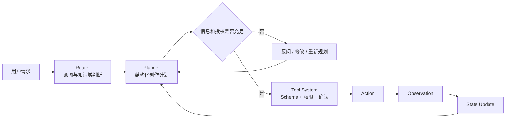
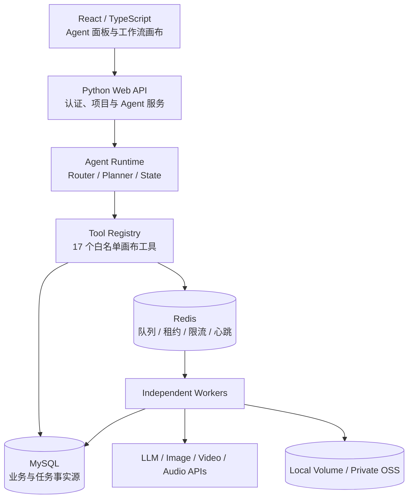

# LongTV

> 多模态创作 Agent 平台 · Project Showcase

LongTV 面向图片、视频和音频创作场景，将用户的自然语言需求转换为可确认、可执行、可恢复的多步骤创作任务。项目覆盖需求澄清、创作规划、提示词生成、画布节点编排、异步生成和任务恢复。

> 本仓库仅用于产品与工程设计展示，不包含生产源码、部署配置、供应商接入代码或任何凭据。

## 项目演示

<!--
上传封面后删除本段注释，并启用下面一行：

-->

建议按下方清单上传截图。提交图片前请隐藏邮箱、服务器 IP、API Key、余额、用户 ID 和真实项目数据。

| 序号 | 展示内容 | 建议文件名 |
|---|---|---|
| 1 | 产品首页或完整画布 | `assets/screenshots/01-cover.webp` |
| 2 | Agent 需求澄清 | `assets/screenshots/02-clarification.webp` |
| 3 | 多步骤计划与用户确认 | `assets/screenshots/03-plan-confirmation.webp` |
| 4 | 图片/视频工作流画布 | `assets/screenshots/04-canvas-workflow.webp` |
| 5 | 多模态生成结果 | `assets/screenshots/05-generation-result.webp` |
| 6 | 异步任务与失败恢复 | `assets/screenshots/06-job-queue.webp` |
| 7 | 管理或运行监控 | `assets/screenshots/07-operations.webp` |

演示视频可放在 `assets/demo/`，也可以在这里添加公开视频链接。

## 核心能力

- 多模态附件理解与创作需求澄清；
- 结构化、多步骤创作计划；
- 图片、视频及音频生成流程；
- Agent 驱动的画布节点查询、创建、修改、连线与执行；
- 画布修改和付费生成前的人工确认；
- 任务排队、进度查询、取消、重试与异常恢复；
- 多用户项目、任务和媒体资源隔离；
- 本地媒体与私有对象存储适配。

## Agent 工作流

当前 Agent 采用规则或 LLM 驱动的知识路由，将对应知识文档注入 Planner。当前版本没有将规则知识路由包装成向量 RAG；语义检索属于后续按数据规模和评测结果决定的演进能力。

## 系统架构

## 工程设计亮点

### 受控工具调用

- 使用 17 个白名单工具覆盖画布读取、节点创建、修改、连接、运行和删除；
- 统一参数 Schema、资源引用解析和副作用分级；
- 模型负责提出动作，服务端负责权限、参数和资源归属校验；
- 修改画布或产生费用的动作必须由用户显式确认。

### 可恢复异步任务

- MySQL 保存完整任务请求、状态和结果，作为持久事实源；
- Redis 只保存任务标识以及可重建的队列、租约、限流和心跳状态；
- 采用 at-least-once 投递，结合幂等键、原子 Claim 和业务状态机控制重复执行；
- Worker 使用租约心跳维持所有权，异常退出后任务可重新协调；
- 网络错误、HTTP 429 和部分 5xx 使用有限退避重试，付费生成不进行无边界重试。

### 并发与多用户隔离

- 按任务类型、用户和供应商三维控制并发；
- 抢不到执行额度的任务进入延迟队列，避免占用 Worker 忙等；
- 画布使用项目 revision 和数据库事务检测并发写入冲突；
- 项目、任务、媒体访问同时校验登录态、项目权限和资源归属。

### 安全与部署

- 用户供应商 API Key 加密写入 MySQL，不进入 Redis 或公开日志；
- 私有对象存储通过服务端鉴权后生成短期签名地址；
- Web、Worker、MySQL、Redis、Nginx 和监控服务使用容器编排；
- 提供存活/就绪探针、优雅停机、备份恢复和发布回滚流程。

## 技术栈

| 层级 | 技术 |
|---|---|
| 前端 | React 18、TypeScript、Vite、Three.js |
| 后端 | Python、PyMySQL、Redis Client、Pydantic、HTTPX |
| Agent | LLM Planner、自定义 Tool Protocol、结构化 JSON 输出 |
| 数据 | MySQL 8.4、Redis 7.4 |
| 多媒体 | OpenCV、PyTorch、FFmpeg、Pillow |
| 存储 | Docker Volume、私有 OSS、签名 URL |
| 部署 | Docker Compose、Nginx、Prometheus |

## 项目边界

- 当前部署形态以单云主机和多 Worker 为主；
- 当前使用单 MySQL 和单 Redis，不宣称已实现数据库集群级高可用；
- 当前知识能力是规则/LLM 路由，不宣称已实现 Embedding、向量数据库或完整 RAG；
- 未经真实压测验证，不在本展示仓库声明具体 QPS、P95 或可用性数字。

## Source Code

This is a showcase-only repository. The production source code, Git history, deployment configuration, credentials, provider adapters, and private datasets are maintained separately and are not included here.

源码目前不公开。如需项目演示或技术交流，请通过 [GitHub Profile](https://github.com/sundasheep-svg) 联系作者。

## Copyright

Copyright © LongTV author. All rights reserved. See [NOTICE.md](NOTICE.md).
