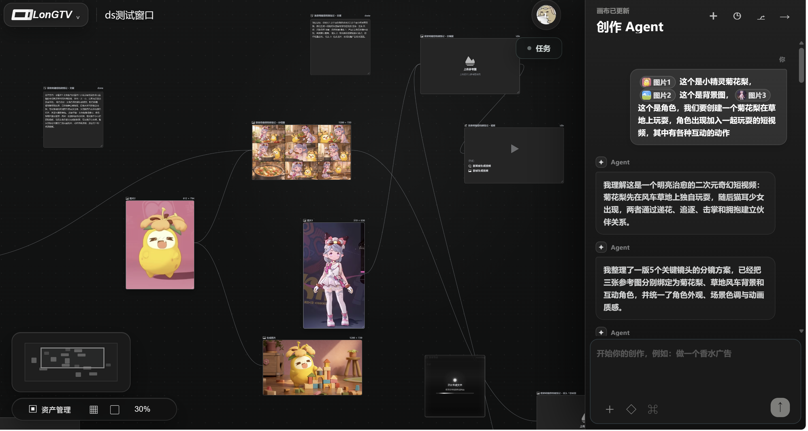
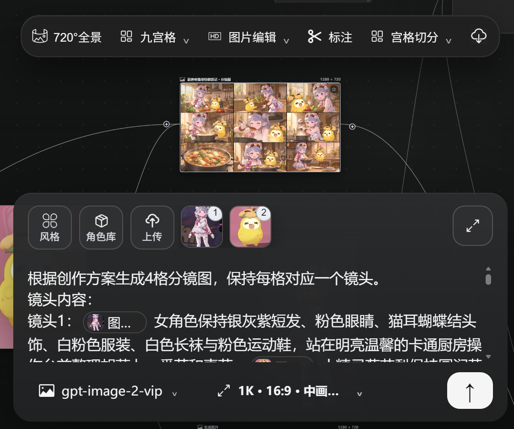
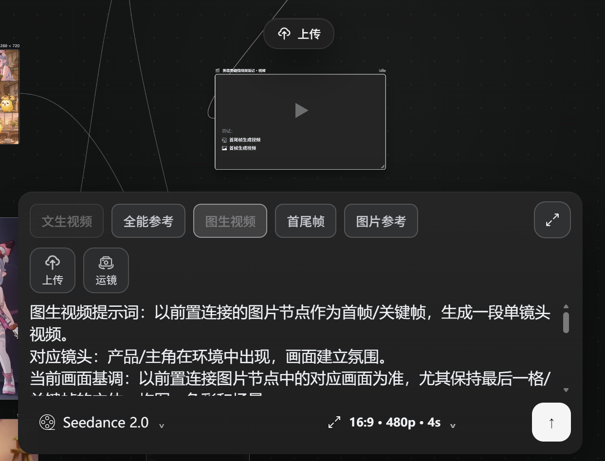
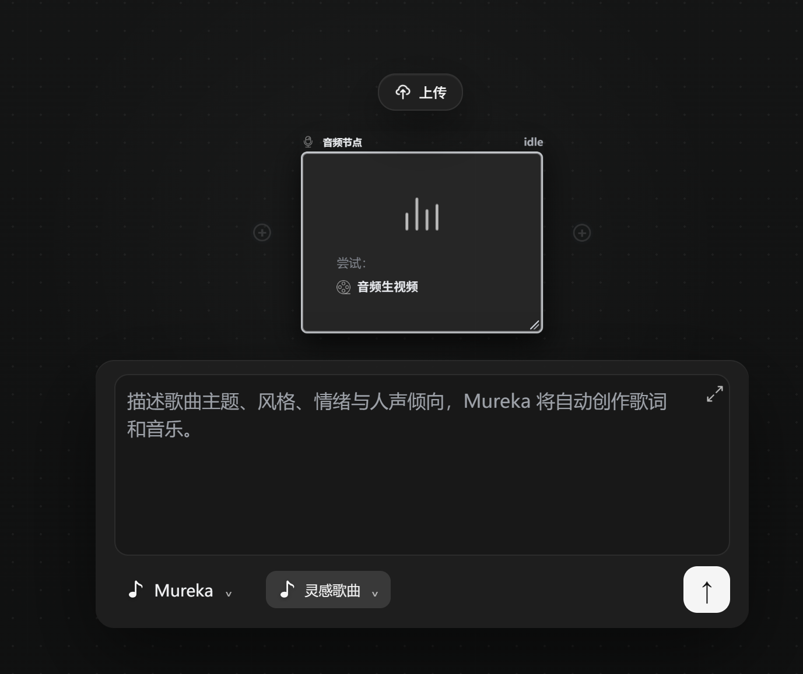
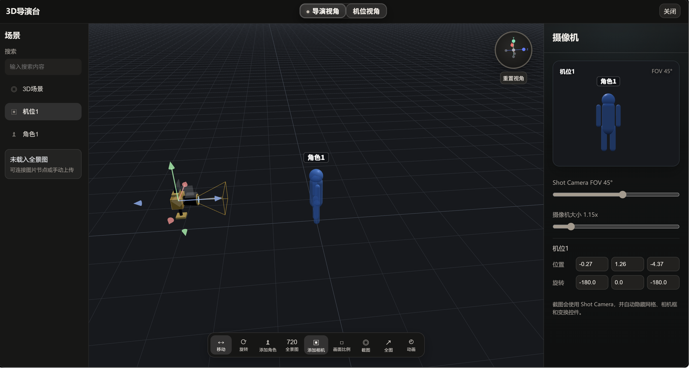
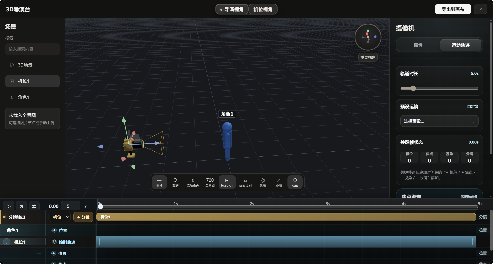
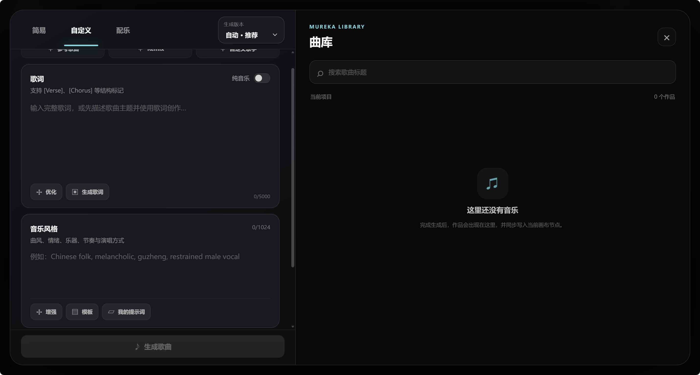
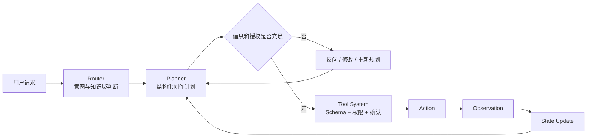
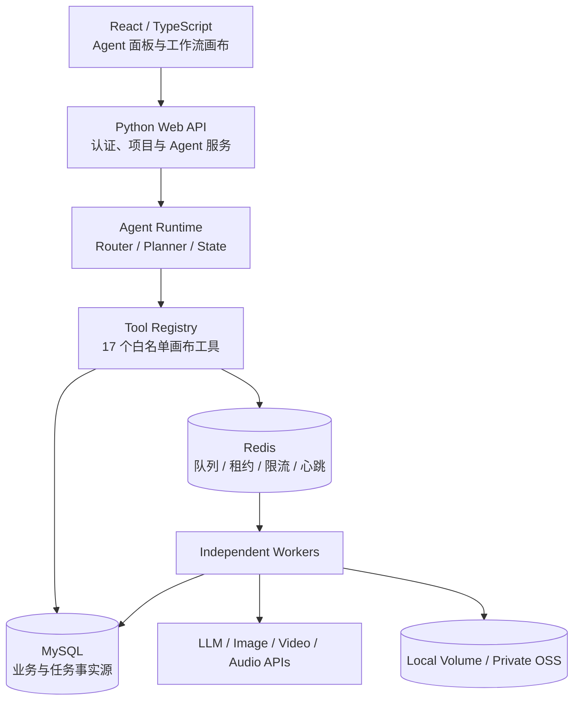

# LongTV

  <strong>面向图片、视频、音频与 3D 分镜创作的多模态 Agent 工作台</strong>

LongTV 将自然语言创作需求转化为可确认、可执行、可恢复的多步骤工作流。用户可以让 Agent 理解参考素材、补全创作条件、拆解镜头计划，并在无限画布中组织图片、视频、音频和 3D 导演节点。

项目重点不只是调用生成模型，而是围绕 Agent 决策、受控工具调用、长任务调度、失败恢复和多用户隔离构建完整工程链路。

> **Showcase only**：本仓库仅展示产品界面与工程设计，不包含生产源码、Git 历史、部署配置、供应商适配代码或任何凭据。

## 产品概览

创作 Agent 可以结合画布状态和用户提供的角色、场景与参考图理解目标，生成结构化创作方案；当信息不足或操作会修改画布、产生费用时，系统先向用户反问或请求确认，再进入执行阶段。

## 多模态创作节点

| 图片节点 | 视频节点 | 音频节点 |
|---|---|---|
|  |  |  |
| 支持参考图、角色、风格、分镜提示词与宫格拆分 | 支持图生视频、首尾帧、全能参考和运镜参数 | 支持歌曲主题、风格、人声倾向与音频生成 |

节点通过显式连线传递参考素材和生成结果，使图片、视频、音频不再是相互独立的表单，而是可以复用上下游上下文的创作工作流。

## 3D 导演与动画时间轴

3D 导演台用于组织场景、角色和摄像机，支持机位、视场角、画幅与截图等导演控制，并可以把镜头结果带回主画布。

动画视图在导演台基础上增加轨道与关键帧，可以编辑机位、焦点、视角、分镜及运动轨迹，让静态场景进一步转化为可执行镜头。

## 音乐创作工作台

音乐工作台支持歌词、纯音乐、曲风、情绪、乐器和人声倾向配置，生成结果进入当前项目曲库，并可回写为画布音频节点参与后续视频编排。

## 核心能力

- **Agent 创作编排**：多模态理解、需求澄清、结构化计划、局部修改和重新规划；
- **节点化工作流**：图片、视频、音频、文本和 3D 导演节点在统一画布中组合；
- **受控工具执行**：17 个白名单工具，统一参数约束、权限校验和副作用确认；
- **可靠长任务**：任务排队、进度查询、取消、有限重试、租约续期和异常恢复；
- **创作资产管理**：生成结果、参考素材和上下游关系随项目持久保存；
- **多用户与安全**：项目资源隔离、个人 API Key 加密、私有对象存储与签名访问；
- **可部署运行**：Web/Worker 分离、容器化编排、健康探针、监控、备份和回滚。

## Agent 工作流

当前 Agent 采用规则或 LLM 驱动的知识路由，将对应知识文档注入 Planner。当前版本没有将规则知识路由包装成向量 RAG；语义检索属于后续按数据规模和评测结果决定的演进能力。

## 系统架构

## 工程设计亮点

### 受控工具调用

- 使用 17 个白名单工具覆盖画布读取、节点创建、修改、连接、运行和删除；
- 统一参数 Schema、资源引用解析和副作用分级；
- 模型负责提出动作，服务端负责权限、参数和资源归属校验；
- 修改画布或产生费用的动作必须由用户显式确认。

### 可恢复异步任务

- MySQL 保存完整任务请求、状态和结果，作为持久事实源；
- Redis 只保存任务标识以及可重建的队列、租约、限流和心跳状态；
- 采用 at-least-once 投递，结合幂等键、原子 Claim 和业务状态机控制重复执行；
- Worker 使用租约心跳维持所有权，异常退出后任务可重新协调；
- 网络错误、HTTP 429 和部分 5xx 使用有限退避重试，付费生成不进行无边界重试。

### 并发与多用户隔离

- 按任务类型、用户和供应商三维控制并发；
- 抢不到执行额度的任务进入延迟队列，避免占用 Worker 忙等；
- 画布使用项目 revision 和数据库事务检测并发写入冲突；
- 项目、任务、媒体访问同时校验登录态、项目权限和资源归属。

### 安全与部署

- 用户供应商 API Key 加密写入 MySQL，不进入 Redis 或公开日志；
- 私有对象存储通过服务端鉴权后生成短期签名地址；
- Web、Worker、MySQL、Redis、Nginx 和监控服务使用容器编排；
- 提供存活/就绪探针、优雅停机、备份恢复和发布回滚流程。

## 技术栈

| 层级 | 技术 |
|---|---|
| 前端 | React 18、TypeScript、Vite、Three.js |
| 后端 | Python、PyMySQL、Redis Client、Pydantic、HTTPX |
| Agent | LLM Planner、自定义 Tool Protocol、结构化 JSON 输出 |
| 数据 | MySQL 8.4、Redis 7.4 |
| 多媒体 | OpenCV、PyTorch、FFmpeg、Pillow |
| 存储 | Docker Volume、私有 OSS、签名 URL |
| 部署 | Docker Compose、Nginx、Prometheus |

## 项目边界

- 当前部署形态以单云主机和多 Worker 为主；
- 当前使用单 MySQL 和单 Redis，不宣称已实现数据库集群级高可用；
- 当前知识能力是规则/LLM 路由，不宣称已实现 Embedding、向量数据库或完整 RAG；
- 未经真实压测验证，不在本展示仓库声明具体 QPS、P95 或可用性数字。

## Source Code

This is a showcase-only repository. The production source code, Git history, deployment configuration, credentials, provider adapters, and private datasets are maintained separately and are not included here.

源码目前不公开。如需项目演示或技术交流，请通过 [GitHub Profile](https://github.com/sundasheep-svg) 联系作者。

## Copyright

Copyright © LongTV author. All rights reserved. See [NOTICE.md](NOTICE.md).
